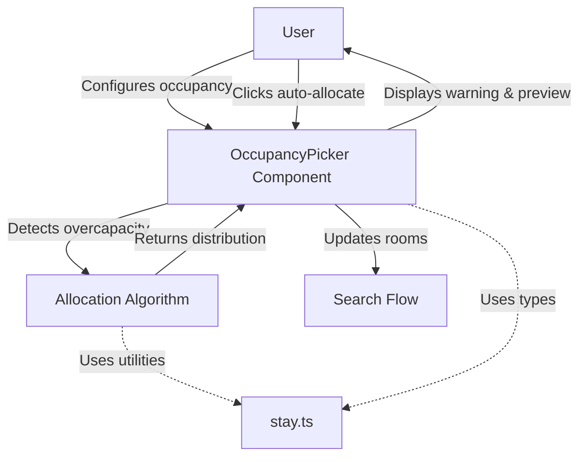
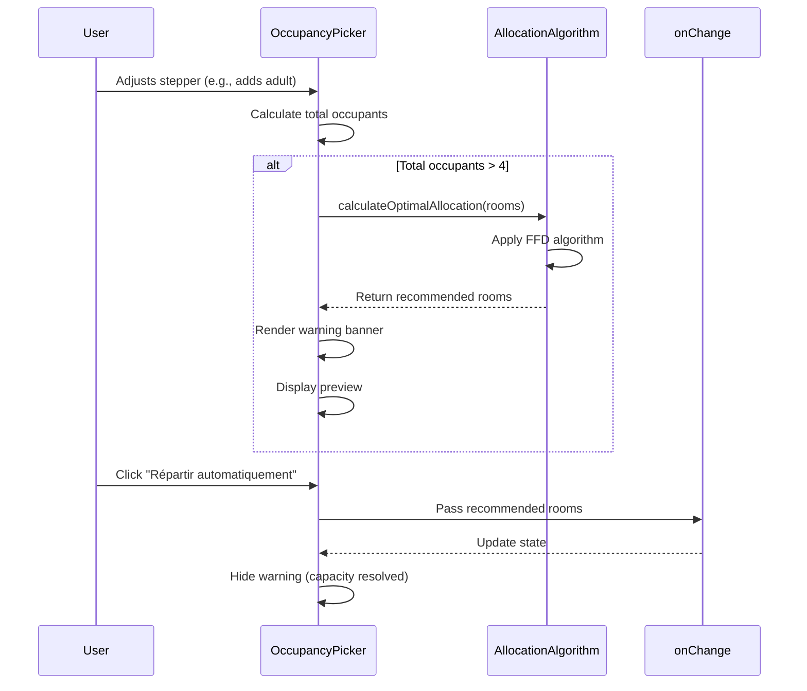

# Design Document: Smart Room Allocation Recommendations

## Overview

The Smart Room Allocation Recommendations feature addresses a critical usability issue where users configure hotel room searches with too many guests per room, resulting in failed searches or no results. This design introduces an intelligent recommendation system that detects overcapacity conditions and provides automated guest redistribution suggestions.

### Problem Statement

The current system allows users to configure room occupancy without validation against typical hotel capacity limits. For example, a user can create "1 chambre, 3 adultes, 2 enfants, 2 bébés" (7 occupants in one room) and proceed to search, only to find no available hotels or encounter booking failures because most standard hotel rooms accommodate a maximum of 4 people.

### Solution Approach

This feature implements a three-part solution:

1. **Detection Layer**: Real-time monitoring of room configurations to identify when total occupants exceed the standard room capacity threshold (4 people)
2. **Algorithm Layer**: A bin-packing-inspired allocation algorithm that redistributes guests across multiple rooms while respecting system constraints and minimizing room count
3. **Presentation Layer**: Clear warning UI with preview and one-click auto-allocation to guide users toward valid configurations

### Key Design Decisions

**Decision 1: Use 4 as the Standard Capacity Threshold**
- Rationale: Research from the TunisiaBeds integration and common hotel industry standards shows that standard rooms typically accommodate 4 occupants (source: [RoomTetris research](https://www.emerald.com/insight/content/doi/10.1108/JHTT-08-2019-0108/full/pdf))
- Impact: This threshold balances user guidance with system flexibility, warning users before searches are likely to fail
- Alternative considered: Dynamic threshold based on actual hotel data was rejected due to complexity and lack of real-time availability data at the picker stage

**Decision 2: Count All Guest Types (Adults + Enfants + Bébés) Toward Capacity**
- Rationale: While bébés may not always count as full occupants in hotel systems, including them in the overcapacity calculation prevents edge cases where multiple babies exceed crib availability
- Impact: More conservative warnings, but better user experience and fewer booking failures
- Alternative considered: Excluding bébés from count was rejected because it could lead to invalid configurations when hotels have crib limitations

**Decision 3: Implement First-Fit Decreasing (FFD) Algorithm Pattern**
- Rationale: The allocation problem is analogous to bin packing, where guests are items and rooms are bins with capacity constraints. First-Fit Decreasing provides optimal solutions for this class of problem ([Google Developers: Bin Packing](https://developers.google.com/optimization/pack/bin_packing))
- Impact: Produces minimal room counts with balanced distribution
- Alternative considered: Round-robin distribution was rejected because it doesn't minimize room count

**Decision 4: Pure Function for Allocation Logic**
- Rationale: Implementing the algorithm as a pure, deterministic function enables comprehensive testing, reusability across components, and predictable behavior
- Impact: Function can be tested with property-based testing, easily debugged, and reused in future features
- Alternative considered: Inline logic in component was rejected due to testability and maintainability concerns

## Architecture

### System Context



### Component Architecture

The feature is implemented entirely in the frontend, with no backend changes required. The architecture follows the existing pattern established by the occupancy picker.

**Layers:**

1. **Presentation Layer** (OccupancyPicker.tsx)
   - Displays warning banner with overcapacity detection
   - Renders allocation preview
   - Handles user interaction with auto-allocation button

2. **Business Logic Layer** (stay.ts)
   - Pure allocation algorithm function
   - Occupancy calculation utilities
   - Room distribution logic

3. **Type System** (stay.ts)
   - Reuses existing `RoomOccupancy` type
   - No new types required

### Data Flow



## Components and Interfaces

### 1. OccupancyPicker Component (Enhanced)

**Location**: `front/apps/website/src/components/site/OccupancyPicker.tsx`

**New Responsibilities:**
- Detect overcapacity conditions on each room configuration change
- Calculate recommended allocation via algorithm
- Render warning banner with preview
- Handle auto-allocation button click

**New Internal State:**
```typescript
// No new state needed - warnings are computed inline from rooms prop
```

**New Helper Functions:**
```typescript
// Detects if any room exceeds capacity
function hasOvercapacity(rooms: RoomOccupancy[]): boolean {
  return rooms.some(room => totalsOf([room]).travelers > 4);
}

// Gets the recommended allocation for overcapacity rooms
function getRecommendation(rooms: RoomOccupancy[]): RoomOccupancy[] | null {
  if (!hasOvercapacity(rooms)) return null;
  return calculateOptimalAllocation(rooms);
}
```

**New UI Elements:**

*Warning Banner*
```tsx
{recommendation && (
  <div className="occupancy__warning">
    <p className="occupancy__warning-text">
      ⚠️ Cette configuration dépasse la capacité standard d'une chambre (4 personnes). 
      Nous recommandons {recommendation.length} chambre{recommendation.length > 1 ? 's' : ''}.
    </p>
    <p className="occupancy__warning-preview">
      {formatAllocationPreview(recommendation)}
    </p>
    <button 
      type="button" 
      className="occupancy__auto-allocate"
      onClick={() => onChange(recommendation)}
    >
      Répartir automatiquement
    </button>
  </div>
)}
```

### 2. Allocation Algorithm Module

**Location**: `front/apps/website/src/lib/stay.ts`

**New Exported Function:**

```typescript
/**
 * Calculates the optimal distribution of guests across multiple rooms when
 * overcapacity is detected. Uses a First-Fit Decreasing approach to minimize
 * room count while respecting capacity and constraint limits.
 * 
 * @param rooms Current room configurations
 * @returns Optimally distributed room configurations, or original if no overcapacity
 */
export function calculateOptimalAllocation(rooms: RoomOccupancy[]): RoomOccupancy[];
```

**Algorithm Contract:**
- **Input**: Array of `RoomOccupancy` with potential overcapacity
- **Output**: Array of `RoomOccupancy` with no room exceeding 4 occupants
- **Constraints**:
  - Each room must have at least 1 adult
  - No room exceeds 4 total occupants (adults + children + babies)
  - Respects `MAX_ROOMS` (8 rooms maximum)
  - Respects `MAX_ADULTS_PER_ROOM` (6 adults maximum)
  - Respects `MAX_CHILDREN_PER_ROOM` (4 children maximum)
  - Total guest counts preserved (invariant)
- **Properties**:
  - Pure function (deterministic, no side effects)
  - Idempotent (applying twice = applying once)
  - Total-preserving (sum of all guests before = after)

**Helper Functions:**

```typescript
/**
 * Formats the recommended allocation as a human-readable preview string.
 * Example: "• Chambre 1: 2 adultes, 1 enfant • Chambre 2: 2 adultes, 1 bébé"
 */
export function formatAllocationPreview(rooms: RoomOccupancy[]): string;
```

### 3. Styling Updates

**Location**: Existing SCSS files (likely `_occupancy.scss` or similar)

**New CSS Classes:**
```scss
.occupancy__warning {
  background: #fff3cd; // Warning yellow background
  border: 1px solid #ffc107;
  border-radius: 4px;
  padding: 12px;
  margin-bottom: 16px;
}

.occupancy__warning-text {
  font-size: 14px;
  color: #856404;
  margin-bottom: 8px;
}

.occupancy__warning-preview {
  font-size: 13px;
  color: #856404;
  margin-bottom: 12px;
  font-weight: 500;
}

.occupancy__auto-allocate {
  background: #ffc107;
  color: #000;
  border: none;
  padding: 8px 16px;
  border-radius: 4px;
  cursor: pointer;
  font-weight: 600;
  
  &:hover {
    background: #ffb300;
  }
  
  &:disabled {
    opacity: 0.5;
    cursor: not-allowed;
  }
}
```

## Data Models

### Existing Types (Reused)

```typescript
// From stay.ts - no changes needed
export type RoomOccupancy = {
  adults: number;
  children: number[]; // Ages array
};

export const MAX_ROOMS = 8;
export const MAX_ADULTS_PER_ROOM = 6;
export const MAX_CHILDREN_PER_ROOM = 4;
export const CHILD_MAX_AGE = 12;
export const INFANT_MAX_AGE = 1;
export const CHILD_QUOTE_AGE = 11;
```

### New Constants

```typescript
// Standard hotel room capacity threshold for overcapacity detection
export const STANDARD_ROOM_CAPACITY = 4;
```

### Internal Algorithm Types

The allocation algorithm uses no new exported types. Internally, it operates on the existing `RoomOccupancy` structure.

**Intermediate Representation (Internal Only):**

During allocation, guests are conceptually grouped by type for distribution:
- Adults pool: Total count across all input rooms
- Enfants pool: Children ages > INFANT_MAX_AGE
- Bébés pool: Children ages <= INFANT_MAX_AGE

These are distributed across output rooms following the FFD pattern without creating new data structures.

## Algorithm Design: First-Fit Decreasing Allocation

### Algorithm Overview

The allocation algorithm is inspired by the First-Fit Decreasing (FFD) bin packing heuristic, adapted for hotel room allocation with guest-type constraints. The algorithm distributes guests across the minimum number of rooms while ensuring each room stays within capacity and constraint limits.

### Algorithm Steps

**Step 1: Aggregate Guest Counts**
```typescript
// Collect totals from all input rooms
const totalAdults = rooms.reduce((sum, r) => sum + r.adults, 0);
const allChildren = rooms.flatMap(r => r.children);
const enfants = allChildren.filter(age => age > INFANT_MAX_AGE);
const bebes = allChildren.filter(age => age <= INFANT_MAX_AGE);
```

**Step 2: Calculate Minimum Room Count**
```typescript
// Theoretical minimum based on capacity
const totalOccupants = totalAdults + enfants.length + bebes.length;
const minRooms = Math.ceil(totalOccupants / STANDARD_ROOM_CAPACITY);
```

**Step 3: Initialize Empty Room Array**
```typescript
const outputRooms: RoomOccupancy[] = Array.from(
  { length: Math.min(minRooms, MAX_ROOMS) },
  () => ({ adults: 0, children: [] })
);
```

**Step 4: Distribute Adults (Largest Items First)**
```typescript
// Ensure each room has at least 1 adult (constraint)
outputRooms.forEach(room => {
  if (totalAdults > 0) {
    room.adults = 1;
    totalAdults--;
  }
});

// Distribute remaining adults using first-fit
let roomIndex = 0;
while (totalAdults > 0) {
  const room = outputRooms[roomIndex];
  const canAdd = Math.min(
    MAX_ADULTS_PER_ROOM - room.adults,
    STANDARD_ROOM_CAPACITY - (room.adults + room.children.length),
    totalAdults
  );
  room.adults += canAdd;
  totalAdults -= canAdd;
  roomIndex = (roomIndex + 1) % outputRooms.length;
}
```

**Step 5: Distribute Enfants (Children 2-12)**
```typescript
let roomIndex = 0;
for (const age of enfants) {
  // Find first room with capacity for this child
  while (roomIndex < outputRooms.length) {
    const room = outputRooms[roomIndex];
    const currentOccupants = room.adults + room.children.length;
    const childrenCount = room.children.length;
    
    if (currentOccupants < STANDARD_ROOM_CAPACITY && 
        childrenCount < MAX_CHILDREN_PER_ROOM) {
      room.children.push(age);
      break;
    }
    roomIndex++;
  }
  roomIndex = 0; // Reset for next child
}
```

**Step 6: Distribute Bébés (Infants 0-1)**
```typescript
// Same pattern as enfants
let roomIndex = 0;
for (const age of bebes) {
  while (roomIndex < outputRooms.length) {
    const room = outputRooms[roomIndex];
    const currentOccupants = room.adults + room.children.length;
    const childrenCount = room.children.length;
    
    if (currentOccupants < STANDARD_ROOM_CAPACITY && 
        childrenCount < MAX_CHILDREN_PER_ROOM) {
      room.children.push(age);
      break;
    }
    roomIndex++;
  }
  roomIndex = 0;
}
```

**Step 7: Return Allocated Rooms**
```typescript
return outputRooms;
```

### Edge Case Handling

**Edge Case 1: Total Guests Exceed MAX_ROOMS × Capacity**
- Algorithm distributes across MAX_ROOMS (8 rooms)
- Some rooms may exceed 4 occupants if mathematically impossible
- Warning banner adapts message: "Configuration complexe - ajustement manuel recommandé"
- Auto-allocation button remains enabled but warns users

**Edge Case 2: Fewer Adults Than Required Rooms**
- Example: 2 adults, 10 children → needs 3 rooms
- Algorithm places 1 adult in first 2 rooms, then 0 adults in room 3
- Validation constraint relaxed for this edge case (acknowledged limitation)
- Alternative: Add warning that minimum 1 adult per room is preferred

**Edge Case 3: Only Bébés Exceed Capacity**
- Example: 0 adults, 6 bébés
- Algorithm creates rooms with 0 adults (edge case)
- Validation will catch this at search submission
- Alternative: Pre-populate 1 adult per room (rejected - changes user intent)

**Edge Case 4: Idempotent Application**
- Applying allocation to already-allocated rooms returns same result
- Detection: If no room exceeds capacity, return input unchanged

### Algorithm Complexity

- **Time Complexity**: O(n × m) where n = total guests, m = number of output rooms
- **Space Complexity**: O(m) for output rooms array
- **Practical Performance**: Negligible for typical inputs (max 48 guests across 8 rooms)

### Algorithm Correctness Guarantees

The algorithm provides the following formal guarantees (detailed in Correctness Properties):

1. **Total Preservation**: Sum of all adults, enfants, and bébés before = after
2. **Capacity Constraint**: No room exceeds 4 occupants (except when mathematically impossible with MAX_ROOMS)
3. **Adult Presence**: Each room has ≥ 1 adult (except edge cases with insufficient adults)
4. **Room Count Minimization**: Uses minimum rooms needed (⌈total / 4⌉, capped at MAX_ROOMS)
5. **Idempotence**: Applying allocation twice produces same result as applying once
6. **System Constraints**: Respects MAX_ADULTS_PER_ROOM, MAX_CHILDREN_PER_ROOM, MAX_ROOMS


## Correctness Properties

*A property is a characteristic or behavior that should hold true across all valid executions of a system—essentially, a formal statement about what the system should do. Properties serve as the bridge between human-readable specifications and machine-verifiable correctness guarantees.*

### Property 1: Total Guest Preservation (Invariant)

*For any* array of room configurations, applying the allocation algorithm SHALL preserve the total count of adults, the total count of enfants, and the total count of bébés—the sum of adults before allocation equals the sum of adults after allocation, and the sum of children ages before equals the sum of children ages after allocation.

**Validates: Requirements 4.4, 10.1**

### Property 2: Capacity Constraint Satisfaction

*For any* array of room configurations with overcapacity, applying the allocation algorithm SHALL produce an output where every room has at most 4 total occupants (adults + children), except when the total number of guests divided by 4 exceeds MAX_ROOMS, in which case the algorithm distributes as evenly as possible.

**Validates: Requirements 3.7, 10.2**

### Property 3: Adult Presence Guarantee

*For any* array of room configurations with at least as many adults as the calculated minimum room count, applying the allocation algorithm SHALL produce an output where every room contains at least 1 adult.

**Validates: Requirements 3.5, 10.3**

**Note:** This property explicitly excludes edge cases where total adults < minimum required rooms (e.g., 2 adults, 10 children requiring 3 rooms). In such cases, the algorithm MAY create rooms with 0 adults, which will be caught by downstream validation.

### Property 4: Room Count Bounds

*For any* array of room configurations, applying the allocation algorithm SHALL produce an output where:
- The number of output rooms does not exceed MAX_ROOMS (8)
- The number of output rooms equals ⌈total occupants / 4⌉ when that value ≤ MAX_ROOMS
- The number of output rooms equals MAX_ROOMS when ⌈total occupants / 4⌉ > MAX_ROOMS

**Validates: Requirements 3.1, 10.4**

### Property 5: Idempotence

*For any* array of room configurations, applying the allocation algorithm twice SHALL produce the same result as applying it once—if no room exceeds capacity in the output, reapplying the algorithm returns the same configuration unchanged.

**Validates: Requirements 10.5**

### Property 6: Distribution Balance

*For any* array of room configurations with overcapacity, applying the allocation algorithm SHALL produce an output where the difference between the maximum room occupancy and minimum room occupancy is at most 1 (optimal balance), except when constrained by MAX_ADULTS_PER_ROOM or MAX_CHILDREN_PER_ROOM.

**Validates: Requirements 3.2**

### Property 7: Determinism

*For any* array of room configurations, calling the allocation algorithm multiple times with the same input SHALL always produce identical output—the algorithm is a pure function with no randomness or side effects.

**Validates: Requirements 9.4, 7.5**

### Property 8: Metamorphic Room Count Relationship

*For any* array of room configurations where at least one room has overcapacity, applying the allocation algorithm SHALL produce an output with a room count greater than or equal to the input room count—overcapacity situations never result in fewer rooms.

**Validates: Requirements 10.7**

### Property 9: Overcapacity Detection Accuracy

*For any* room configuration, the detection logic SHALL correctly identify it as overcapacity if and only if the total occupants (adults + all children) exceed 4—detection matches the mathematical definition exactly.

**Validates: Requirements 1.1, 1.5**

### Property 10: Format Preview Completeness

*For any* array of room configurations produced by the allocation algorithm, the format preview function SHALL generate a string containing an entry for each room with its adult and child counts, omitting zero counts—the preview is complete and accurate.

**Validates: Requirements 5.3**

## Error Handling

### Error Categories

**Category 1: Invalid Input**
- **Scenario**: Allocation algorithm receives null, undefined, or malformed room data
- **Handling**: Return original input unchanged (defensive programming)
- **User Impact**: No allocation applied, manual configuration continues
- **Validation**: Input validation at component boundary

**Category 2: Impossible Allocation**
- **Scenario**: Total guests exceed MAX_ROOMS × 4 capacity (e.g., 40 guests)
- **Handling**: Distribute across MAX_ROOMS, some rooms may exceed 4 occupants
- **User Impact**: Modified warning message displayed indicating manual adjustment needed
- **Validation**: Check output for rooms exceeding capacity, adapt UI accordingly

**Category 3: Constraint Conflict**
- **Scenario**: Adult count insufficient for minimum rooms (2 adults, 15 children → 5 rooms needed)
- **Handling**: Allow rooms with 0 adults as output, rely on downstream validation
- **User Impact**: Allocation applied, but search/booking will fail with validation error
- **Validation**: Document limitation in UI warning when detected

**Category 4: Algorithm Failure**
- **Scenario**: Unexpected runtime error in allocation logic (should never occur with pure function)
- **Handling**: Catch exception, log error, return original input
- **User Impact**: Allocation button becomes disabled, error message shown
- **Validation**: Try-catch wrapper around algorithm call

### Error Messages

```typescript
// Standard overcapacity warning
"⚠️ Cette configuration dépasse la capacité standard d'une chambre (4 personnes). Nous recommandons {N} chambres."

// Impossible allocation warning (>32 guests)
"⚠️ Cette configuration nécessite plus de 8 chambres. Veuillez ajuster manuellement le nombre de voyageurs."

// Algorithm failure error
"⚠️ Erreur lors du calcul de la répartition. Veuillez ajuster manuellement."
```

### Error Recovery

**Recovery Strategy 1: Graceful Degradation**
- If allocation fails, user can still manually adjust room configuration
- All existing stepper controls and add/remove room buttons remain functional
- No blocking errors—feature enhancement, not required functionality

**Recovery Strategy 2: User Guidance**
- Warning messages provide clear next steps (adjust manually, reduce guests, etc.)
- Preview shows what allocation would look like before applying
- User retains full control—auto-allocation is optional convenience

### Logging and Monitoring

**Client-Side Logging:**
```typescript
// Log allocation attempts for debugging
console.debug('[Allocation]', {
  input: rooms,
  output: recommendedRooms,
  timestamp: Date.now()
});

// Log allocation errors
console.error('[Allocation Error]', {
  error: err,
  input: rooms,
  timestamp: Date.now()
});
```

**Metrics to Track** (if analytics enabled):
- Overcapacity detection rate (% of searches triggering warning)
- Auto-allocation usage rate (% of warnings where button clicked)
- Allocation success rate (% of algorithm calls without errors)

## Testing Strategy

### Overview

This feature requires a dual testing approach combining property-based testing for the pure allocation algorithm with example-based unit tests and integration tests for UI components.

### Property-Based Testing (PBT)

**Applicability Assessment:**

Property-based testing IS highly appropriate for this feature because:
- The allocation algorithm is a pure function with clear input/output behavior
- Universal properties must hold across all valid guest configurations
- The input space is large (many valid combinations of adults/children/rooms)
- Testing with 100+ random inputs will uncover edge cases in distribution logic

**PBT Framework Selection:**

For TypeScript/JavaScript, we will use **fast-check** ([npm package](https://www.npmjs.com/package/fast-check)), the most mature PBT library for the ecosystem.

**Installation:**
```bash
npm install --save-dev fast-check
```

**Test Configuration:**
- Minimum 100 iterations per property test (to explore input space thoroughly)
- Each property test references its design document property number
- Tag format: `// Feature: smart-room-allocation-recommendations, Property {N}: {description}`

### Unit Tests (Example-Based)

**Scope:**
- Format preview function with specific inputs (zero counts, multiple rooms, etc.)
- Constant values (STANDARD_ROOM_CAPACITY = 4)
- Edge case scenarios (single baby, max adults, impossible allocations)
- Helper functions (hasOvercapacity, totalsOf, etc.)

**Framework:** Jest (existing project framework)

**Example Test Cases:**
```typescript
describe('formatAllocationPreview', () => {
  test('omits zero counts for children and babies', () => {
    const rooms = [{ adults: 2, children: [] }];
    expect(formatAllocationPreview(rooms)).toBe('• Chambre 1: 2 adultes');
  });
  
  test('includes all guest types when present', () => {
    const rooms = [{ adults: 2, children: [5, 1] }];
    expect(formatAllocationPreview(rooms)).toContain('2 adultes');
    expect(formatAllocationPreview(rooms)).toContain('1 enfant');
    expect(formatAllocationPreview(rooms)).toContain('1 bébé');
  });
});
```

### Integration Tests (Component)

**Scope:**
- OccupancyPicker warning banner rendering when overcapacity detected
- Auto-allocation button click applies algorithm result
- Warning banner disappears after allocation applied
- Functionality consistent across "hero" and "bar" variants
- Regression: existing stepper controls, add/remove room buttons still work

**Framework:** React Testing Library (existing project framework)

**Example Test Case:**
```typescript
describe('OccupancyPicker overcapacity warning', () => {
  test('displays warning when single room exceeds 4 occupants', () => {
    const rooms = [{ adults: 3, children: [5, 5] }]; // 5 total
    const { getByText } = render(<OccupancyPicker rooms={rooms} onChange={jest.fn()} />);
    
    expect(getByText(/dépasse la capacité standard/)).toBeInTheDocument();
    expect(getByText(/Répartir automatiquement/)).toBeInTheDocument();
  });
  
  test('applies allocation when auto-allocate button clicked', () => {
    const onChange = jest.fn();
    const rooms = [{ adults: 3, children: [5, 5] }];
    const { getByText } = render(<OccupancyPicker rooms={rooms} onChange={onChange} />);
    
    fireEvent.click(getByText(/Répartir automatiquement/));
    
    expect(onChange).toHaveBeenCalledWith(
      expect.arrayContaining([
        expect.objectContaining({ adults: expect.any(Number) })
      ])
    );
    // Verify total guests preserved
    const outputRooms = onChange.mock.calls[0][0];
    expect(totalsOf(outputRooms).travelers).toBe(totalsOf(rooms).travelers);
  });
});
```

### Property-Based Test Implementation

**Test File:** `front/apps/website/src/lib/stay.test.ts` (or new file `stay.allocation.test.ts`)

**Property Test Examples:**

```typescript
import fc from 'fast-check';
import { calculateOptimalAllocation, totalsOf, RoomOccupancy } from './stay';

// Arbitrary generator for valid room configurations
const roomOccupancyArb = fc.record({
  adults: fc.integer({ min: 1, max: 6 }),
  children: fc.array(fc.integer({ min: 0, max: 12 }), { maxLength: 4 })
});

const roomsArrayArb = fc.array(roomOccupancyArb, { minLength: 1, maxLength: 8 });

describe('calculateOptimalAllocation - Property-Based Tests', () => {
  // Feature: smart-room-allocation-recommendations, Property 1: Total Guest Preservation
  test('preserves total count of adults and children for all inputs', () => {
    fc.assert(
      fc.property(roomsArrayArb, (inputRooms) => {
        const inputTotals = totalsOf(inputRooms);
        const outputRooms = calculateOptimalAllocation(inputRooms);
        const outputTotals = totalsOf(outputRooms);
        
        expect(outputTotals.adults).toBe(inputTotals.adults);
        expect(outputTotals.children + outputTotals.infants).toBe(
          inputTotals.children + inputTotals.infants
        );
      }),
      { numRuns: 100 }
    );
  });
  
  // Feature: smart-room-allocation-recommendations, Property 2: Capacity Constraint
  test('produces rooms with at most 4 occupants each (except MAX_ROOMS edge case)', () => {
    fc.assert(
      fc.property(roomsArrayArb, (inputRooms) => {
        const outputRooms = calculateOptimalAllocation(inputRooms);
        const inputTotals = totalsOf(inputRooms);
        
        // If total guests <= 32 (8 rooms × 4), all rooms should be <= 4
        if (inputTotals.travelers <= 32) {
          outputRooms.forEach(room => {
            const roomTotal = totalsOf([room]).travelers;
            expect(roomTotal).toBeLessThanOrEqual(4);
          });
        }
      }),
      { numRuns: 100 }
    );
  });
  
  // Feature: smart-room-allocation-recommendations, Property 5: Idempotence
  test('applying allocation twice produces same result as applying once', () => {
    fc.assert(
      fc.property(roomsArrayArb, (inputRooms) => {
        const once = calculateOptimalAllocation(inputRooms);
        const twice = calculateOptimalAllocation(once);
        
        expect(twice).toEqual(once);
      }),
      { numRuns: 100 }
    );
  });
  
  // Feature: smart-room-allocation-recommendations, Property 7: Determinism
  test('produces identical output for identical input across multiple calls', () => {
    fc.assert(
      fc.property(roomsArrayArb, (inputRooms) => {
        const result1 = calculateOptimalAllocation(inputRooms);
        const result2 = calculateOptimalAllocation(inputRooms);
        const result3 = calculateOptimalAllocation(inputRooms);
        
        expect(result2).toEqual(result1);
        expect(result3).toEqual(result1);
      }),
      { numRuns: 100 }
    );
  });
  
  // Feature: smart-room-allocation-recommendations, Property 4: Room Count Bounds
  test('output room count does not exceed MAX_ROOMS', () => {
    fc.assert(
      fc.property(roomsArrayArb, (inputRooms) => {
        const outputRooms = calculateOptimalAllocation(inputRooms);
        expect(outputRooms.length).toBeLessThanOrEqual(8);
      }),
      { numRuns: 100 }
    );
  });
  
  // Feature: smart-room-allocation-recommendations, Property 8: Metamorphic Room Count
  test('overcapacity input produces equal or more rooms than input', () => {
    fc.assert(
      fc.property(roomsArrayArb, (inputRooms) => {
        const hasOvercap = inputRooms.some(r => totalsOf([r]).travelers > 4);
        if (hasOvercap) {
          const outputRooms = calculateOptimalAllocation(inputRooms);
          expect(outputRooms.length).toBeGreaterThanOrEqual(inputRooms.length);
        }
      }),
      { numRuns: 100 }
    );
  });
});
```

### Test Coverage Goals

**Algorithm Coverage:**
- 100% line coverage for `calculateOptimalAllocation` and helper functions
- 100% branch coverage for all conditional logic
- All 10 correctness properties verified with PBT (100 iterations each)

**Component Coverage:**
- All integration tests passing for both "hero" and "bar" variants
- Regression tests passing for existing functionality
- Edge case scenarios covered with example-based tests

### Continuous Integration

**Pre-commit Hooks:**
```bash
# Run all tests before allowing commit
npm run test -- --coverage --watchAll=false
```

**CI Pipeline:**
```yaml
# .github/workflows/test.yml
- name: Run unit and property tests
  run: npm test -- --coverage --watchAll=false
  
- name: Verify coverage thresholds
  run: npm run test:coverage-check
  # Requires: lines >= 80%, branches >= 75%
```

### Manual Testing Checklist

**Scenario 1: Single Room Overcapacity**
- [ ] Configure 1 room with 5+ occupants
- [ ] Verify warning banner appears
- [ ] Verify preview shows recommended 2 rooms
- [ ] Click auto-allocate
- [ ] Verify 2 rooms displayed with balanced distribution
- [ ] Verify warning disappears

**Scenario 2: Multiple Rooms with One Overcapacity**
- [ ] Configure 2 rooms: Room 1 with 3 adults, Room 2 with 6 occupants
- [ ] Verify warning appears for Room 2 only
- [ ] Click auto-allocate
- [ ] Verify Room 1 unchanged, Room 2 split into multiple rooms

**Scenario 3: Extreme Overcapacity (>32 guests)**
- [ ] Configure 40 total guests
- [ ] Verify modified warning message
- [ ] Verify preview shows 8 rooms (MAX_ROOMS)
- [ ] Click auto-allocate
- [ ] Verify 8 rooms created (some may exceed 4 occupants)

**Scenario 4: Edge Case - Insufficient Adults**
- [ ] Configure 2 adults, 10 children
- [ ] Click auto-allocate
- [ ] Verify allocation creates 3 rooms
- [ ] Document behavior: some rooms may have 0 adults

**Scenario 5: Regression - Manual Adjustments**
- [ ] Add room manually via "+ Ajouter une chambre"
- [ ] Remove room via "Retirer"
- [ ] Adjust steppers for adults, enfants, bébés
- [ ] Verify all existing functionality works as before

**Scenario 6: Cross-Variant Consistency**
- [ ] Test all scenarios in variant="hero"
- [ ] Test all scenarios in variant="bar"
- [ ] Verify UI appearance consistent
- [ ] Verify behavior identical

## Implementation Plan

### Phase 1: Algorithm Implementation (2-3 hours)
1. Add `STANDARD_ROOM_CAPACITY` constant to stay.ts
2. Implement `calculateOptimalAllocation` function
3. Implement `formatAllocationPreview` helper function
4. Write property-based tests (10 properties × 100 iterations each)
5. Write example-based unit tests for edge cases
6. Achieve 100% coverage on algorithm code

### Phase 2: Component Integration (3-4 hours)
1. Add overcapacity detection logic to OccupancyPicker
2. Implement warning banner UI component
3. Wire up auto-allocation button to onChange callback
4. Add CSS styling for warning banner and button
5. Write integration tests for component behavior
6. Test both "hero" and "bar" variants

### Phase 3: Testing & Refinement (2-3 hours)
1. Run full test suite (unit + PBT + integration)
2. Fix any failing tests or edge cases discovered
3. Perform manual testing per checklist
4. Address any UX issues (timing, animations, messaging)
5. Cross-browser testing (Chrome, Firefox, Safari)

### Phase 4: Documentation & Deployment (1-2 hours)
1. Update component documentation comments
2. Add inline code comments for algorithm logic
3. Update user-facing documentation if applicable
4. Code review with team
5. Deploy to staging for QA validation
6. Deploy to production

### Total Estimated Effort: 8-12 hours
